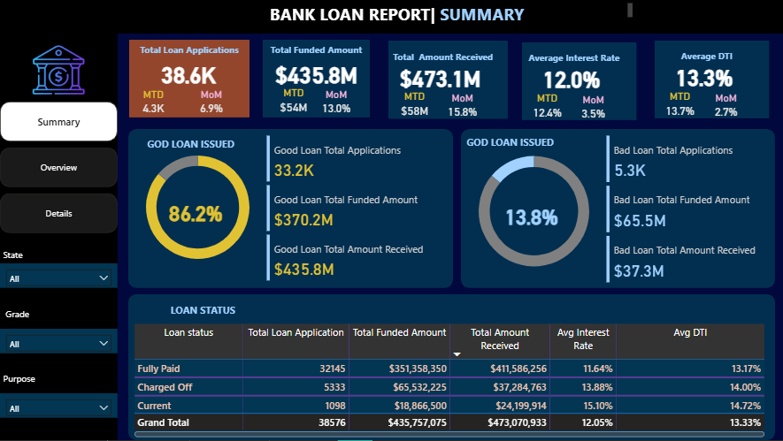
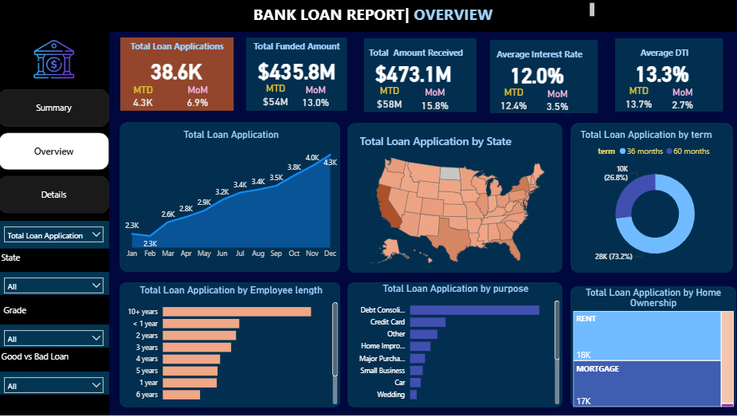
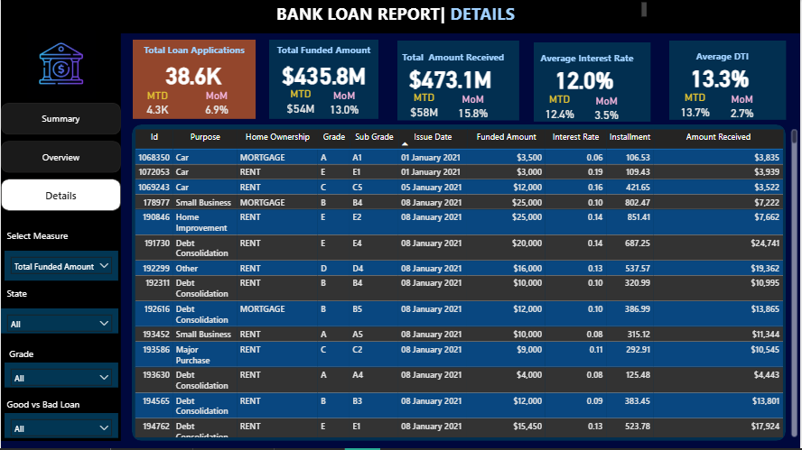

# 📊 Bank Loan Analysis Project (EXCEL, SQL & Power BI)

## 📌 Project Overview
This project provides a comprehensive analysis of a bank’s loan portfolio to monitor **loan performance, credit risk, and repayment trends**. 
Using **SQL** for data extraction and **Power BI** for advanced visualization, the analysis tracks **38,576 loan applications** totaling **$435.8M** in funded value.

The objective is to deliver **data-driven insights** that empower stakeholders to optimize lending strategies and mitigate default risks.

---

## 🔗 Live Dashboard
👉 **[View Interactive Power BI Report](https://app.powerbi.com/view?r=eyJrIjoiMmMwNmNjNDUtMWMzZi00MmQ5LTg2MWItMTQ0YmUyOThkYjBhIiwidCI6IjJmY2Q2MDIxLTI1NjEtNDM5Yy1hN2JmLWFlNmUxOGYyNzQ5MSJ9)**

---

## 📈 Executive Summary (Summary View)


### Key Portfolio Metrics
- **Total Loan Applications:** **38.6K**
  - Month-to-Date (MTD): **4.3K** (6.9% MoM ↑)
- **Total Funded Amount:** **$435.8M** (13.0% MoM ↑)
- **Total Amount Received:** **$473.1M** (15.8% MoM ↑)
- **Average Interest Rate:** **12.0%**

---

## 🩺 Financial Health & Risk Analysis (DTI)
A critical component of this analysis was evaluating the **Financial Health** of borrowers using the **Debt-to-Income (DTI)** ratio.

- **Portfolio Average DTI:** **13.3%**
- **Good Loan DTI (13.1%):** Borrowers with lower debt burdens show a high repayment success rate, contributing to the **86.2% Good Loan** status.
- **Bad Loan DTI (14.0%):** A clear correlation exists between higher DTI ratios and default risk. Charged-off loans exhibit higher average DTIs, signaling that increased debt-to-income pressure is a primary driver of credit risk.

📌 *Monitoring DTI trends allows the bank to tighten lending criteria for applicants nearing the 14% threshold to minimize future losses.*

---

## 📊 Trends and Distribution (Overview View)


- **Seasonality:** Consistent growth throughout the year, peaking in **December (4.3K apps)**.
- **Loan Term:** **73.2%** of borrowers preferred **36-month terms**, indicating a preference for shorter debt cycles.
- **Stable Segments:** Borrowers with **10+ years of employment** represent the largest and most reliable applicant group.

---

## 📑 Transactional Details (Details View)


| Loan Status | Applications | Total Funded Amount | Total Amount Received | Avg Interest Rate | Avg DTI |
| :--- | :---: | :---: | :---: | :---: | :---: |
| **Fully Paid** | 32,145 | $351.4M | $411.6M | 11.64% | 13.17% |
| **Charged Off** | 5,333 | $65.5M | $37.3M | 13.88% | 14.00% |
| **Current** | 1,098 | $18.9M | $24.2M | 15.10% | 14.72% |

---

## 🧰 Tools & Technologies
- **SQL (SQL Server)** – Data cleaning, MTD/MoM growth calculations, and status classification,etc.
- **Power BI** – DAX measures, data modeling, and interactive visualization.
- **Excel** – Initial data audit and validation.

---

## 📁 Repository Structure
```text
├── Dashbord_Images/
│   ├── Summary.PNG              # Executive KPIs
│   ├── Overview.PNG             # Trends and Distributions
│   └── Details.PNG              # Transactional grid view
├── SQL_Query_Results/           # Query outputs
├── Bank_Loan_Dashboard.pbix     # Power BI Project File
├── KPI_and_Dashboard_Queries.sql # SQL code for all KPIs
└── README.md